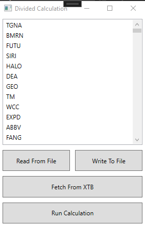
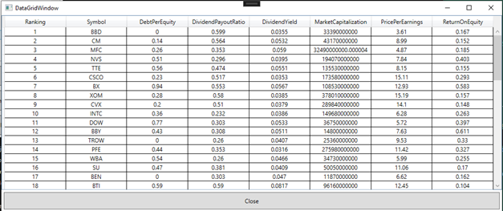

# DividendStatTool

This repository contains the source code for a tool to scrap statistical data about companies.

### Overall information

- The application was implemented to scrap data from [finviz](https://finviz.com/](https://finviz.com/).

- The application was implemented using:
  
  - .NET 6.0
  
  - WPF UI framework
  
  - XUnit framework for tests
  
  - Fluent Assertions for higher test readability
  
  - xAPI library for communication with [XTB Broker](https://www.xtb.com/en)

- The tool allows to display potentially the best comapnies to buy shares in terms of dividends.

### Functionality

- The main functionality is to display a list of companies that meet the set of fixed requirements. The tool displays a list of companies that have:
  
  - Price Per Earnings proportion greater than 20
  
  - Dividend Payout Ratio between 20% and 60%
  
  - Dividend Yield greater than 2%
  
  - Debt Per Equity proportion less than 1
  
  - Return on Equity greater than 10%
  
  - Market Capitalization greater than 10 mld $

- The user can determine a list of companies to be scrapped and calculated. The list of companies can be:
  
  - uploaded from a local file
  
  - downloaded from the XTB broker

- The user can download all symbols of US companies that exist in XTB broker.
  
  - The user must have private account at XTB and provide his username and password to download existing symbols.
  
  - There is possibility to save downloaded symbols to a local file to avoid logging into the XTB service each time.

- Main application window:

- Final results window:

### TODO List

- Add a dependency container instead of manually injecting dependencies in `App.cs`

- Add more advanced sorting algorithms - for example assign different ranks for different factors.

- Make the scrapping process multithreaded.

- Add different options for manipulating symbols such as the ability to manually enter new symbols and delete existing ones.

- Add possibility to download symbols from XTB based on additional criteria such as stock exchange region.

- Improve existing code - increase readability and make code less coupled more cohesive.

